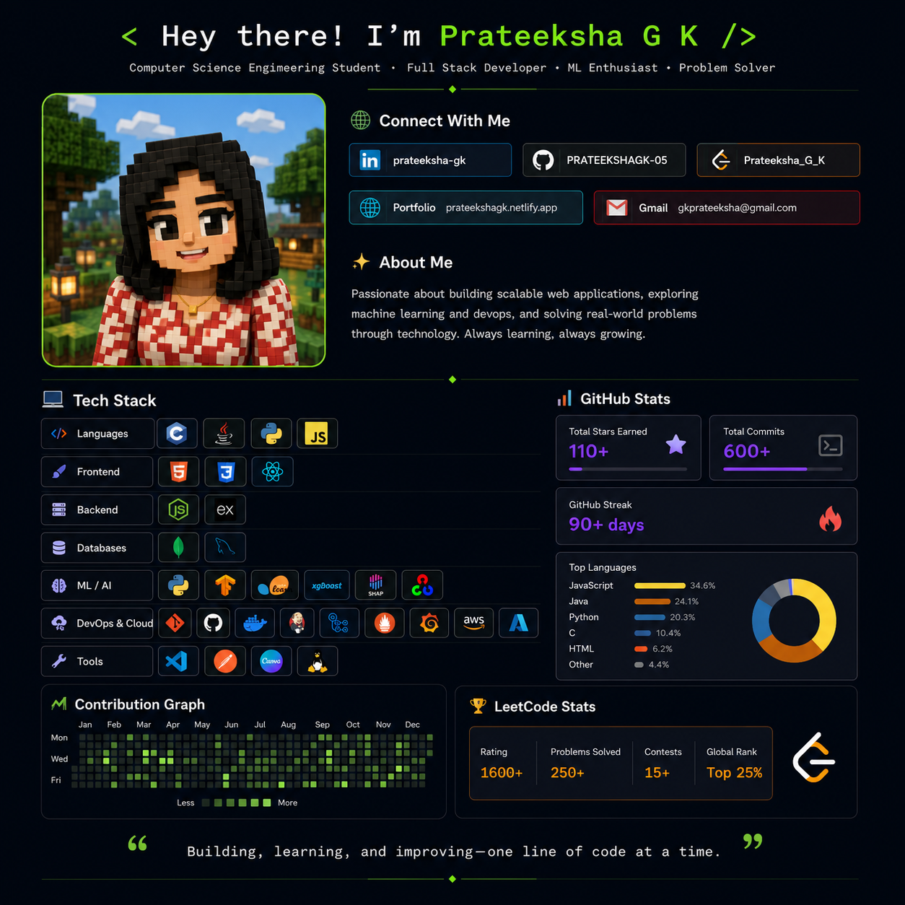

  

<h1 align="center">
  
</h1>

<h3 align="center">
Passionate about building scalable web applications, exploring Machine Learning, and solving real-world problems through technology.
</h3>

---

# 🌐 Connect With Me

---

# 👩‍💻 About Me

🎓 B.E. Computer Science and Engineering student at **Kongu Engineering College**

💡 Interested in

- Full Stack Web Development
- Machine Learning
- Artificial Intelligence
- DevOps
- Problem Solving

🏆 Winner of multiple Hackathons

📚 Currently working on an Explainable AI based DDoS Detection Framework for HAPS Networks.

---

# 💻 Tech Stack

### Languages

---

### Frontend

---

### Backend

---

### Databases

---

### Machine Learning & AI

---

### DevOps & Cloud

---

### Tools

---

# 🚀 Featured Projects

### 🏙️ CityConnect – Smart Citizen Super App

A MERN-based citizen engagement platform featuring complaint management, emergency assistance, role-based access control, Twilio integration, and real-time notifications.

---

### 🩸 Centralized Blood Bank Network Hub

An intelligent blood bank management platform with multilingual AI chatbot assistance, donor-hospital coordination, FIFO inventory management, and Razorpay payment integration.

---

### 🛡️ Adaptive Chaotic Jaya & XGBoost Based DDoS Detection for HAPS Networks

An ongoing research project focused on developing an explainable machine learning framework for detecting DDoS attacks in High Altitude Platform Station (HAPS) communication networks.

---

### 😊 Sentiment Analysis Using AI

A multilingual sentiment analysis system developed using Python and VADER for emotion classification and visualization.

---

# 🏆 Achievements

🥇 Winner — Solution Fit Category, BYTS Hackathon

🥈 Second Prize — HACKON'2.0, MCET

🥈 Second Prize — KEC Hackathon

🏅 Oracle Java SE17 Developer Certified

🏅 MongoDB Certified Associate Developer

🏅 Selected for Internal Smart India Hackathon (SIH)

---

# 📊 GitHub Statistics

---

# 📈 Contribution Graph

---

# 💻 LeetCode Stats

---

# ✍️ Quote

---

⭐ Thanks for visiting my profile! Feel free to explore my repositories and connect with me.

